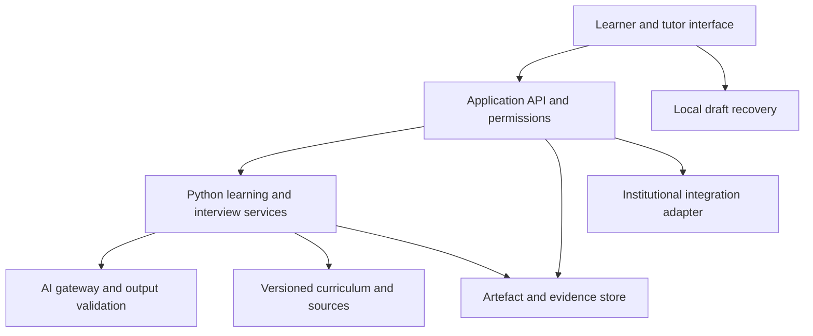

# WritingLab: implementation plan and Cursor architecture prompt

Companion to WritingLab_Proposal.md, WritingLab_Proposal_Addendum.md and WritingLab_Gamified_Writing_Grammar_Proposal.docx. Revised 8 September 2026.

This is an implementation specification, not implemented or tested application code. The proposed architecture is conditional on inspection of the complete local repository.

## How to use this handover

Place this file and the proposal in the repository's `docs` directory and provide both to Cursor as context.

**Do not paste this entire document as a single prompt.** It specifies more work than any agent will hold in working context at usable fidelity, and an agent given all of it at once reliably does the first third well and produces thin or invented versions of the rest. Use it as the reference specification, and drive execution one phase at a time using the phase prompts in section 12.

The phases are gated. Each ends at an explicit stop point requiring human review before the next begins.

---

## 1. Product and delivery plan

**Product promise:** help learners develop, express, scrutinise and transfer their own reasoning, while making permitted AI co-creation transparent. The product must distinguish quality of the finished artefact, quality of human editorial judgement, and independently demonstrated writing capability.

The proposal defines seven provisional personas and 16 reusable activities. The first release targets three capabilities: calibrating claims, connecting evidence through warrants, and organising coherent paragraphs. Include *Interview my thinking* in this first release, because it offers an accessible route from incomplete ideas into a purposeful writing activity.

| Stage | Delivery | Acceptance and decision |
|---|---|---|
| 0. Repository and learning audit | Verify current flows, persistence, versions, tests and claimed defects; document missing dependencies; prepare one educator-reviewed source pack; open the data-protection conversation | A reproducible baseline and explicit architecture decision record; no invented audit results; one authored activity used to calibrate authoring effort |
| 1. Reliable learning records | Separate attempts, completions, rewards and evidence; introduce persistent artefacts and versioned snapshots | Failed attempts do not imply mastery; retry does not duplicate rewards; hiding game UI does not erase history |
| 2. End-to-end learning slice | Claim-calibration mission with accessible editor, feedback, revision, evidence record and a fresh transfer variant | Learner can finish and recover work after interruption; teacher can interpret the evidence |
| 3. Interview and co-create | Adaptive Q&A, confirmed idea map, outline, scaffold/joint-draft options and contribution links | No unapproved inferred position; no automatic overwrite; earlier-answer edits invalidate dependent confirmations |
| 4. Frontend decision | Compare the same editor/interview slice in existing Reflex and a bounded Next.js prototype | Choose based on reliable interaction, access and maintenance effort; record evidence rather than preference |
| 5. Pilot readiness | Three skill families, lightweight tutor review, access testing, reviewed content and evaluation instrumentation | No known critical loss-of-work, access or evidence-integrity defect; human-rated AI feedback benchmark reviewed; data-protection position resolved |
| 6. Institutional validation | Formative HE and apprenticeship pilots, followed by a properly powered comparative evaluation if feasible | Assess unseen independent writing with delayed follow-up against equivalent study-assistant support |

These stages are work packages, not calendar promises. Content authoring, access testing, AI evaluation and engineering need named owners. A feasibility sample is not evidence of causal effectiveness. Do not expand to a complete curriculum, social competition or high-stakes automated grading before validating the initial slice.

---

## 2. Proposed system boundaries

The frontend owns interaction and unsynchronised drafts. The backend owns identity, policy, version checks, submissions, evidence, rewards and learning rules. A model proposes questions and feedback; deterministic application code controls state transitions and permissions. Start as a modular application, not a distributed microservice estate.

Next.js with TypeScript is the preferred candidate for a complex production editor, with Python retained behind an API. Keep Reflex available until the equivalent slice demonstrates a genuine engineering advantage. A direct React component inside Reflex may be sufficient. Neither framework choice proves accessibility or learning value.

---

## 3. Execution contract

**This section governs every phase and overrides anything below it that appears to conflict.**

### 3.1 Standing rules

- **Plan before code, every phase.** Return the plan and stop. Do not begin implementation until it is approved. This applies even when a phase looks trivial.
- **Never commit.** Do not commit, do not create pull requests, do not push. Stage nothing unless explicitly asked, and then stage files by name; never `git add .`.
- **Work on an isolated branch.** Create it in the first action of Phase 0 and confirm the branch name in your first report. This is not conditional.
- **Additive and fail-closed.** Prefer adding to removing. Where a guard is ambiguous, the safe default is the restrictive one. Never erase existing records to simplify a schema.
- **Windows PowerShell environment.** Use `Select-String`, not `grep`.
- **British English** in code comments, documentation and all learner-facing copy.
- **No secrets in the repository.** API keys, connection strings and credentials are environment variables. If you find a secret committed, report it immediately and do not proceed until instructed.
- **Pin dependencies.** Any dependency you add is pinned to an exact version, with a one-line justification in the plan. Check existing lockfiles before selecting versions.
- **Do not deploy.** No external deployment forms part of this task, under any phase.
- **Delete scratch scripts after use.** Anything written into `demo_outputs/` is a deliverable and is never deleted.

### 3.2 When you cannot proceed

You will hit things this specification did not anticipate. When that happens:

- **If a specified behaviour is impossible or unwise given the actual code**, stop and say so, with the specific constraint you hit. Do not implement a degraded version silently and do not invent a workaround that changes the meaning of a requirement.
- **If a source-review finding turns out to be wrong**, record it as not reproduced in `docs/verification.md` and move on. Do not fix a defect that does not exist.
- **If an external dependency is missing**, provide the working local route and name the precise blocked operation. Missing deployment credentials are not a reason to stop local implementation.
- **If you disagree with the specification**, say so once, with reasoning, and then follow it unless overruled. Do not silently substitute your judgement.

### 3.3 Never claim

These are reporting failures, and they are more damaging than implementation failures because they are invisible.

- Never claim a finding is a runtime reproduction unless you actually reproduced it.
- Never report a test as passing without running it and showing the output.
- Never claim that documentation, fixtures or a compiled UI demonstrate educational effectiveness, accessibility conformance or secure assessment.
- Never claim a mock validates actual model behaviour.
- Never describe an automated accessibility check as user testing.

### 3.4 If you can only do one thing

The requirements below are not equal. In priority order:

1. **Do not lose or corrupt learner work.** Every other requirement is subordinate to this.
2. **Do not let assisted work become independent evidence.** Evidence integrity is the product's entire claim.
3. **Do not break what currently works.** The existing app must remain runnable at every checkpoint.
4. Everything else.

---

## 4. Phase 0: inspect before changing

**Read-only except for the branch and the three documentation files listed below.**

Read applicable AGENTS.md instructions and the actual repository. Start with ARCHITECTURE.md, README, documentation, `layout.py`, `theme.py`, `writing_lab.py`, `lab_state.py`, `dashboard.py`, `free_write.py`, `practice.py`, `editor.py`, `feedback_panel.py`, `mastery.py` and `mode_toggle.py`. Find the imported domain, AI-service, exercise-bank, persistence and custom-editor implementations; the earlier review did not have all of them. Inspect lockfiles and configuration before selecting package versions. Never assume an upload's flat directory is the real package layout.

Check `git status` and preserve unrelated edits. Record baseline commands and their actual results.

### 4.1 Questions to answer explicitly

The proposal notes that state is described as session-scoped to avoid database-related crashes. Establish the truth of this first, because it determines the size of Phase 1.

1. Is there any persistence at all today? If state is session-scoped, are there existing learner records to migrate, or is the schema being created from nothing?
2. Is there migration tooling (Alembic, or anything else)? If not, how have schema changes been applied to any deployed instance?
3. What is the exact pinned Reflex version, and what does it constrain?
4. Is there a test suite? Does it currently pass? Show the output.
5. Where does AI configuration live, and are credentials currently server-side?

### 4.2 Verify these source-review findings against the local code

Do not fix them yet. Confirm or refute each, with a file and line reference.

- Casual mode suppresses completion history.
- Repetition may pick completed items indefinitely.
- Bank progress mixes modes and generated IDs.
- Failed attempts count as completed.
- Free-writing analysis may award repeated XP for unchanged text.

### 4.3 Deliverables

Create `docs/implementation-plan.md`, `docs/architecture-decision.md` and `docs/verification.md`. Record assumptions, actual file mappings and remaining blockers.

**Gate: stop here.** Report findings and wait for approval before any code change. Your report must state the branch name, which findings reproduced, the answers to 4.1, and any way in which this specification does not survive contact with the actual repository.

---

## 5. Phase 1: product conditions and persistence

### 5.1 Separate the conditions that are currently conflated

Introduce independent fields for experience (`practise` / `co_create` / `demonstrate`), instructional assistance, access supports, assessment context and visible gamification. Store assessment policy and version server-side.

Do not equate a product mode with an assessment lane. A home-browser no-AI mode is independent practice, not a secure examination. Verified demonstration requires authorised human judgement and documented assessment conditions. Do not hard-code Sydney's policy as BPP's approved policy.

Keep private drafting distinct from portfolio submission. Explain what is saved, retained and shared. Hiding XP leaves learning records intact. Support dictation, keyboard access and multilingual planning without a blanket assistance penalty. Record translation or generated wording when relevant to the writing construct. Do not infer diagnoses.

### 5.2 Domain services and persistence

Reuse viable Python logic, separating UI state from curriculum, attempts, feedback, interview orchestration, evidence and rewards. Use the repository's supported relational database if suitable; otherwise document a PostgreSQL production target with a lightweight local development option. Use migrations and transactions.

Define versioned models with explicit IDs, timestamps and ownership. At minimum:

- **ActivityDefinition**: id/version, target skills, genre, audience, source-pack version, prompt, permitted claims, acceptable response range, rubric version, scaffold ladder, independent variant and review status.
- **Attempt**: learner, activity/version, experience, policy version, status, submission snapshot, assistance events and result. Distinguish started, submitted, evaluated and completed; success and completion are different fields.
- **Artefact and DocumentSnapshot**: owner, stable document ID, immutable revision ID, parent revision, ordered blocks with stable IDs, text, source references and content hash. Hash equality is a technical duplicate check, not evidence of authorship.
- **Feedback**: exact snapshot and block/span reference, rubric/model versions, criterion, explanation, supporting source IDs, suggested next action and review status. Anchors become stale when their referenced text changes; never silently attach old feedback to unrelated text.
- **InterviewSession**: owner, document ID, state, current revision, purpose, audience, genre, policy and assistance choice.
- **InterviewTurn**: stable question ID, visible question, answer versions, typed/dictated/imported origin and timestamps. Do not store hidden chain-of-thought.
- **IdeaNode**: statement, originating answer IDs, source IDs, origin (learner-stated / AI-inferred / AI-suggested), confirmation state and version.
- **OutlineNode**: rhetorical purpose, linked idea IDs, order and confirmation version.
- **Suggestion and Decision**: AI output, input revision, referenced ideas/sources, accepted/adapted/rejected/pending state, optional learner reason and resulting revision.
- **EvidenceEvent**: event ID, actor, server receipt time, object/version, event type, conditions and relevant visible contribution. Keep content payloads minimised and subject to retention and deletion policy; audit integrity is not permission to retain personal text forever.
- **RewardLedger**: unique eligibility key, reason, amount and related qualifying event. Repeat requests return the previous outcome. Do not award XP for arbitrary prompts or repeated analysis of identical text.
- **CapabilityEvidence**: skill, originating attempt, conditions, rubric outcome, date and verification status. Separate supported, independent-practice and verified-demonstration evidence. Remove sample mastery data and invented percentages.

**Design CapabilityEvidence as a shared contract.** It is intended to become the common evidence schema across Writing Lab, FeedbackHub and ConCraftr. Only Writing Lab writes to it in this release, but do not design something that makes a shared store impossible later.

**Retention fields are not optional.** The data-protection position is unresolved, so every model holding learner text carries the fields required to implement a retention policy that has not yet been decided. Retrofitting these is expensive.

### 5.3 Access control and consistency

Use authenticated ownership checks for every object access; role checks for tutor and assessor functions; optimistic concurrency for edits; idempotency keys for mutating submissions and AI requests; and transactions for submission, evidence and reward commits. Historical records with unknown conditions must stay labelled unknown rather than being promoted to verified evidence.

### 5.4 Write the tests first

For the five integrity behaviours below, write the failing test before the fix. These are the behaviours the product's credibility rests on, and a passing test written after the fix proves considerably less.

1. A failed attempt does not produce a completion record.
2. A repeated reward request returns the previous outcome rather than a second award.
3. Identical free-writing text analysed twice awards nothing the second time.
4. Hiding gamification leaves completion history intact.
5. A completed item is not selected again by repetition logic.

**Gate: stop here.** Report the migration applied, the tests written and their output before and after, and confirmation that the app still runs.

---

## 6. Phase 2: the authored activity engine

Seed a small, reviewed content set covering claim calibration, evidence and warrants, and paragraph coherence. Give each skill at least a supported and a genuinely different transfer activity. Use supplied source packs or clearly labelled fictional cases. No fabricated real citations. Feedback should accept defensible alternatives rather than one canonical sentence.

**Do not author the content yourself.** Build the engine and the schema, seed with whatever reviewed material exists, and report exactly what content is missing. Activity content is educator-authored and educator-reviewed; generating it inside this task produces unreviewed material that will look finished and is not.

Use the proposal's mission grammar: purpose, target move, material, learner action, assistance condition, artefact, feedback and return task. Keep these as composable steps rather than compulsory screens. Convert the workbook's rhetorical purpose and optional sentence fragments into editable move cards. Do not import its assertions as verified facts or force every introduction into its 22-sentence order.

Keep sentence stems partially completed. Show one priority intervention, invite revision, then let the learner explain a consequential choice. Allow challenges to feedback. Schedule fresh practice based on recorded evidence with a simple documented initial rule; do not claim a validated adaptive mastery model.

**Gate: stop here.**

---

## 7. Phase 3: Interview my thinking

Use states: setup, eliciting, reflecting, outlining, composing, reviewing, complete; add paused and recoverable-error handling without losing the previous state. Persist state transitions. Model output cannot bypass prerequisites or server policy.

Default interaction: one focused question at a time, a text field with optional dictation, a visible current-purpose summary and an expandable idea map. Provide skip, revise answer, ask why, pause/resume and finish exploration controls. A progress indicator describes stages, not an arbitrary question quota. Keep a linear accessible alternative to multiple panels.

Ask first about audience and intended outcome, then the learner's central idea. Select follow-up questions from actual gaps: definition, example, mechanism, evidence, qualification, counterargument or implication. Do not mechanically ask every question. After several substantive answers, offer a reflection checkpoint. Learners may continue exploring.

The reflection shows learner-stated points separately from AI-inferred interpretations and new AI suggestions. Ask the learner to correct or confirm the substantive interpretation before drafting from it. Produce an editable outline linked to confirmed idea versions. Composition choices are: provide stems, jointly draft one paragraph, or draft from the confirmed outline where the policy allows it. In Practise, enforce the configured scaffold ladder; in Co-create, allow broader drafting while retaining provenance.

Never turn uncertainty into certainty or introduce a new position as the learner's own. Missing sources become an explicit evidence-needed marker or a question. Generated paragraphs link to the answer, idea, outline and source versions that informed them. The learner reviews a suggestion before applying it; applying creates a new document revision. Acceptance does not reclassify AI wording as learner-authored.

If an earlier answer changes, invalidate affected idea confirmations, outline approvals and generated suggestions. Preserve the existing draft but label affected provenance stale. Provide a review action; never silently regenerate over the learner's edits. Check semantic links as proposed relationships, not forensic proof. Do not compute human-authorship percentages.

For dictation, allow transcript correction and record corrected versions; raw audio is off by default. For first-language answers, preserve the original and translated interpretation separately. Do not require speech. After composition, offer a short new-topic writing task targeting one move, stored as separate evidence, without withholding access to the finished draft.

**Gate: stop here.**

---

## 8. API contracts and AI boundaries

Applies across Phases 2 and 3.

Adapt route naming to the existing application, keeping these operations explicit: create and list artefacts; save snapshot with expected parent revision; submit attempt idempotently; request feedback for a specified revision; start and resume interview; answer and revise turn; confirm idea version; propose and confirm outline; request draft suggestion; apply and reject suggestion; export evidence.

Interview responses should return structured fields: `session_revision`, `state`, `next_question`, `idea_changes`, `unresolved_questions` and `permitted_actions`. Draft responses return `input_revision`, `blocks`, `provenance_links` and `unsupported_claims`. Validate fields and references before accepting output. Schema validity alone does not establish educational quality.

Use a provider abstraction. Separate interviewer, drafter, coach and evaluator configurations even if they share a model. Keep credentials server-side. Validate source IDs against authorised materials. Treat documents and answers as untrusted content; ignore instructions inside them that attempt to change policy. Bound input size, rate, cost and retries. Support cancellation and explicit failure states. **A timeout must not produce success, reward or state advancement.** A late response must be checked against the current session and document revision.

Provide deterministic development fixtures exercising normal, malformed, delayed and failed responses. Clearly label simulated AI. When no live provider is configured, keep authored activities usable and show which functions are unavailable.

---

## 9. The editor

Keep keystrokes and selection local; synchronise versioned snapshots using a recoverable queue. Display saved, pending and conflicted states in plain language. On conflict preserve both versions and offer resolution. Clear user-specific cached data appropriately on logout and shared devices, following the chosen retention policy. Do not log every keystroke or require a websocket round trip to type.

Keep draft, feedback and interview context available without forcing constant navigation. Provide meaningful headings, labels, focus management, screen-reader announcements for completed responses rather than every token, adjustable text, zoom and reflow, text alternatives to colour, and keyboard alternatives to dragging. Support composition input methods and preserve cursor position through updates. Avoid motion or timers as completion requirements.

Implement evidence export as a readable summary plus structured JSON: task and conditions; learner contributions; substantive AI assistance; editorial decisions; revision links; source references; separate transfer results; limitations and verification status. Preview what is shared. Do not expose other learners' data, API secrets, hidden model reasoning or unrelated private drafts. The first release needs local export; defer real institutional integrations until their requirements and credentials exist.

---

## 10. Verification

Add focused tests for: failed attempts versus completion; idempotent rewards and submissions; stale feedback; concurrent saves; interruption recovery; ownership and assessor permissions; server-side assistance restrictions; malformed and late AI responses; earlier-answer invalidation; no draft before required confirmation; accepted AI text remaining labelled AI-assisted; independent evidence not created from assisted retries; export scope and redaction.

Run end-to-end journeys with authored content and deterministic AI fixtures.

For accessibility, run automated checks with a named tool (axe or equivalent) and record the tool and version. Perform manual keyboard, zoom and reflow, and screen-reader checks where tools permit. **Report these as three distinct categories: automated checks, manual verification by the developer, and testing with real disabled users.** Only the third supports a conformance claim, and it is out of scope for this task.

Evaluate live AI separately on educator-rated examples, including multilingual phrasing, unsupported fluent claims and alternative valid answers. Keep versioned examples of false corrections and meaning distortion.

For learning validation, instrument baseline and delayed fresh tasks, not just usage. Do not build fake efficacy dashboards. Tutor judgement is required for verified demonstration. No leaderboard, compulsory streak, prompt-count reward, authorship detector or automated high-stakes grade in this release.

---

## 11. Reporting

At each gate, update `docs/implementation-plan.md` and stop.

Each report contains: actual changes made, file by file; commands run with their real output; tests written and their results; manual checks performed; anything specified that you did not implement and why; untested risks; rollback instructions; and the next bounded work item.

Keep the app runnable and the changes reviewable at every gate.

---

## 12. Phase prompts

Drive execution with these, one at a time. Each assumes this document and the proposal are in context.

**Phase 0**
> Execute Phase 0 of docs/WritingLab_Cursor_Architecture_Prompt.md. Read-only except for the branch and the three docs files. Answer section 4.1 explicitly, verify the findings in 4.2 against the code with file and line references, and produce the three documents. Stop at the gate and report. Do not change application code.

**Phase 1**
> Execute Phase 1. Plan first and stop for approval. When approved, write the five failing tests in 5.4 before any fix. Report test output before and after. Stop at the gate.

**Phase 2**
> Execute Phase 2. Build the engine and schema only; do not author activity content. Report exactly what content is missing. Stop at the gate.

**Phase 3**
> Execute Phase 3. The interview state machine and provenance rules are the substance; treat section 7 as the specification and section 8 as the contract. Stop at the gate.

Phase 4, the frontend decision, is specified separately in `WritingLab_NextJS_Migration_Prompt.md`.
